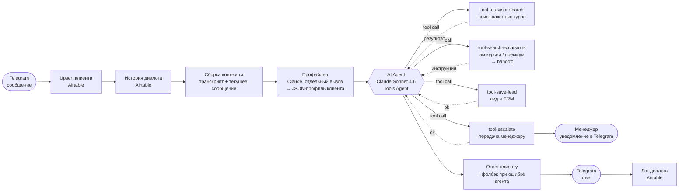

# Telegram-ассистент туристического агентства на LLM-агенте (n8n + Claude)

Продакшен-бот, который ведёт первичный диалог с клиентами турагентства в Telegram: выясняет запрос, ищет реальные пакетные туры через API агрегатора Tourvisor, сохраняет лиды в CRM и передаёт клиента живому менеджеру, когда нужен человек.

Построен на n8n: оркестрация, интеграции и инструменты — воркфлоу, «мозг» — Tools Agent на Claude Sonnet 4.6. Репозиторий — витрина архитектуры: все ключи, идентификаторы и данные клиентов вычищены (см. [Запуск](#запуск)).

> Скриншоты канваса: `screenshots/` (добавлю отдельно)
>
> 
> 

---

## Что делает бот

- Отвечает клиентам 24/7 в Telegram тепло и на «Вы», ведёт к заявке на подбор тура (короткая веб-анкета или пошаговый сбор параметров в чате).
- Ищет **реальные** пакетные туры с живыми ценами через Tourvisor (90+ туроператоров) и пересказывает только то, что вернул поиск.
- Сохраняет квалифицированный лид в CRM (Airtable) и ведёт историю диалога.
- Строит скрытый **профиль клиента** (сегмент, состав поездки, стиль общения) отдельным вызовом LLM — агент использует его для тона, клиенту профиль не показывается.
- **Эскалирует на менеджера**: готовность бронировать, вопрос о точной цене, экскурсионные и премиум-запросы, по которым нет структурированного API.

Жёсткие ограничения в системном промпте: не выдумывать цены, наличие мест и визовые правила; не называть отели «из памяти модели»; не принимать оплату и не обещать бронь; отправлять только одну разрешённую ссылку.

---

## Архитектура агента

| Воркфлоу | Роль |
|---|---|
| [`main-bot-handler.json`](workflows/main-bot-handler.json) | Telegram-триггер, память, профайлер, агент, ответ и логирование |
| [`tool-tourvisor-search.json`](workflows/tool-tourvisor-search.json) | Асинхронный поиск туров: справочники → старт поиска → поллинг статуса → топ-3 |
| [`tool-tourvisor-search-ratelimited.json`](workflows/tool-tourvisor-search-ratelimited.json) | Версия поиска с защитой от 429 (кейс ниже) |
| [`tool-search-excursions.json`](workflows/tool-search-excursions.json) | «Тул-маршрутизатор»: собирает параметры и возвращает агенту инструкцию передать запрос менеджеру |
| [`tool-save-lead.json`](workflows/tool-save-lead.json) | Запись лида в CRM |
| [`tool-escalate.json`](workflows/tool-escalate.json) | Запись эскалации в CRM + уведомление менеджера в Telegram |

Каждый инструмент — отдельный под-воркфлоу n8n (`Execute Workflow Trigger`). Агент видит его как функцию с описанием и параметрами; служебные поля (Telegram ID, профиль) подставляются оркестратором, а не моделью.

**Память** — не встроенная память агента, а явная: каждое сообщение пишется в Airtable, на следующем ходе история собирается в транскрипт и подаётся в промпт. Это делает состояние диалога прозрачным для менеджера и переживает перезапуски.

---

## Агентный цикл: как модель выбирает инструмент и когда зовёт человека

Используется n8n Tools Agent: на каждом ходе модель получает системный промпт, транскрипт, скрытый профиль и описания четырёх инструментов, затем сама решает — ответить текстом или вызвать инструмент, получить результат и продолжить, пока не сформирует финальный ответ.

Выбор инструмента управляется двумя слоями:

1. **Описания инструментов** задают условия вызова: поиск Tourvisor — «только для пакетного зарубежного отдыха», с явными ограничениями на параметры (диапазон дат ≤ 21 дня, ночи, возраст детей); `save-lead` и `escalate` — «вызывай ОДИН раз».
2. **Системный промпт** задаёт бизнес-правила поверх: когда сразу давать анкету, что считать готовностью к брони, как подавать найденные туры (только факты из результата, отделять их от общих советов).

**Передача человеку** происходит в трёх случаях:

- **Клиент готов бронировать или просит точную цену** — агент вызывает `escalate` (запрос + краткая суть), затем `save-lead`, и сообщает клиенту, что специалист свяжется. Менеджер получает уведомление в Telegram, запись появляется в таблице эскалаций.
- **Нет надёжного источника данных** — экскурсионные, авторские и премиум-туры. Для них нет API уровня Tourvisor, а общий веб-поиск возвращает тематические страницы без цен и наличия. Поэтому `tool-search-excursions` намеренно не ищет: он собирает параметры и возвращает агенту инструкцию передать запрос на ручной подбор. Честный handoff вместо правдоподобной выдумки.
- **Агент не справился** — у ноды агента включён error output; при сбое клиент получает вежливое сообщение вместо тишины.

---

## Кейс: 429 Too Many Requests от Tourvisor

**Симптом.** Поиск туров периодически падал с `429 Too Many Requests` от API агрегатора.

**Причина — не трафик клиентов, а сам агент.** Поиск в Tourvisor асинхронный, и один вызов инструмента — это не один запрос, а около дюжины: справочник стран, справочник городов вылета, старт поиска, до восьми опросов статуса и выгрузка результатов. Агент же вызывал инструмент повторно — например, на просьбу «поищи ещё раз» или после уточнения одного параметра. Лимита шагов и бюджета на вызовы не было, поэтому два-три повторных поиска за разговор давали 30+ запросов к API: модель сама размножала нагрузку.

**Решение** (в [`tool-tourvisor-search-ratelimited.json`](workflows/tool-tourvisor-search-ratelimited.json)):

| Мера | Реализация | Эффект |
|---|---|---|
| Суточный кэш справочников | Страны и города вылета хранятся в `workflow static data` с TTL 24 ч | Минус 2 запроса на каждый поиск; справочники меняются раз в год, а не раз в минуту |
| Повтор при сбое | `retryOnFail`: 3 попытки с паузой 5–6 с на всех HTTP-запросах | Кратковременные 429 и таймауты не роняют поиск |
| Сокращение поллинга | Потолок 8 опросов × 6 с и ранний выход, как только найдено ≥12 отелей | ~50 с максимум вместо ~2 мин; меньше запросов статуса на каждый поиск |
| Валидация до запроса | Если страна или город не найдены в справочнике — инструмент сразу возвращает агенту текст ошибки без похода в API | Не тратим квоту на заведомо пустой поиск |

**Что бы я доделал.** Пауза между повторами сейчас фиксированная — правильнее экспоненциальный backoff с jitter и учётом заголовка `Retry-After`. И главное: кэш и ретраи лечат симптом. Корень — отсутствие у агента бюджета на вызовы. Об этом следующий раздел.

---

## Что бы я сделал иначе на LangGraph

n8n позволил быстро собрать работающий продукт, но агентный цикл в нём — чёрный ящик: шаги, повторы и переходы к человеку задаются промптом, а не кодом. На LangGraph я бы вынес это в явную структуру:

- **Явный граф состояний вместо одного Tools Agent.** Узлы `profile → plan → search → respond`, плюс отдельный узел `handoff`. Состояние (`TypedDict`) хранит собранные параметры поездки, результаты поиска и счётчики, а переходы задаются условными рёбрами в коде. Правило «эскалируй, когда клиент готов бронировать» становится проверяемым ребром графа, а не надеждой на промпт.
- **Лимит шагов и бюджет на инструменты.** `recursion_limit` на граф плюс счётчик вызовов поиска в состоянии: не более одного поиска Tourvisor за ход, повторный — только если изменились параметры. Это убирает исходную причину 429 детерминированно, а не уговорами в описании инструмента.
- **Human-in-the-loop через checkpointer.** `interrupt_before=["handoff"]` и `PostgresSaver` с `thread_id` = Telegram chat ID: граф останавливается перед передачей, менеджер одобряет или правит черновик ответа, выполнение продолжается с того же места. Заодно checkpointer заменяет ручную сборку истории из CRM — память диалога становится встроенной и переживает рестарты.
- **Честный фолбэк.** Ошибка агента ведёт в тот же узел `handoff`, а не только в текстовое сообщение (см. known issues).
- **Наблюдаемость.** Трассировка каждого шага (LangSmith или OpenTelemetry): какие инструменты вызывались, сколько токенов и запросов к API стоил ход. В n8n это видно только по логам выполнений.

---

## Known issues

- **Фолбэк не эскалирует.** При ошибке агента клиент получает сообщение о передаче вопроса менеджеру, но в этой ветке эскалация фактически не вызывается. Нужно направить error output агента в `tool-escalate`.
- **Описание тула экскурсий расходится с реализацией.** Для агента это «поиск по сайтам операторов», а по факту — handoff. Описание стоит привести в соответствие, чтобы модель не обещала клиенту результаты поиска.
- **Защита от 429 вынесена в отдельную версию тула** (`-ratelimited`). Перенос в основной поиск и бюджет на вызовы в агенте — следующий шаг.

---

## Запуск

1. Импортируйте воркфлоу в n8n (Workflows → Import from File): сначала инструменты, затем `main-bot-handler`.
2. Заполните плейсхолдеры:

| Плейсхолдер | Что подставить |
|---|---|
| `YOUR_ANTHROPIC_API_KEY` | ключ Anthropic (лучше вынести в n8n Credentials, а не в заголовок) |
| `Bearer YOUR_TOURVISOR_API_TOKEN` | токен Tourvisor Search API |
| `REPLACE_TOURVISOR_LOGIN` / `REPLACE_TOURVISOR_PASS` | доступ к Tourvisor XML API (версия `-ratelimited`) |
| `REPLACE_AIRTABLE_BASE_ID`, `REPLACE_AIRTABLE_TABLE_*` | база Airtable с таблицами Clients, Dialogs, Leads, Escalations |
| `REPLACE_WITH_<tool>_WORKFLOW_ID` | ID импортированных под-воркфлоу инструментов |
| `REPLACE_MANAGER_TG_ID` | Telegram chat ID менеджера |
| `REPLACE_CREDENTIAL_ID` | ваши credentials Telegram, Airtable, Anthropic |
| `https://example.com/form/tour-request` | ссылка на анкету подбора тура |

3. Создайте Telegram-бота через @BotFather; Telegram-триггеру нужен публичный HTTPS URL (`WEBHOOK_URL` в n8n).

**Стек:** n8n · Claude Sonnet 4.6 (Anthropic) · Telegram Bot API · Airtable · Tourvisor API
